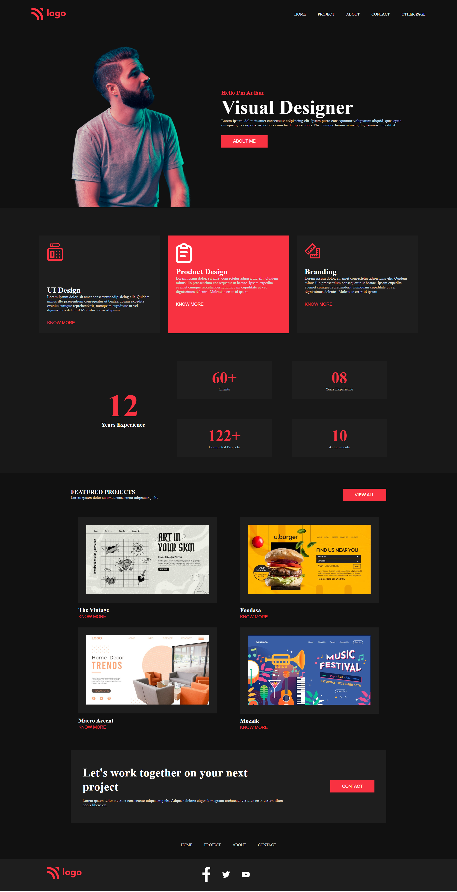

# Project_15 - HTML  and CSS 

---

## Project 15 [Live Link](https://project-15-themohitgupta.netlify.app)

---
## What I learned from this Project?

- Learnd about **cards**.
- Learnd about **grid**.
- Learnd about **tackle svgs**.
- Learnd about **flexbox** in detail.
- Learnd about **reusable button**.
- Learnd about **full flefged website**.

---

### This Project too me around **5 hours** to complete.

---

---
